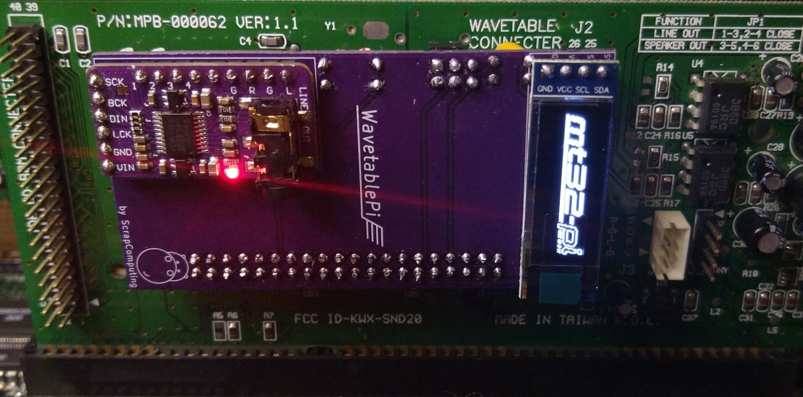
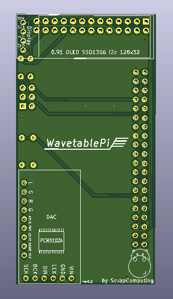
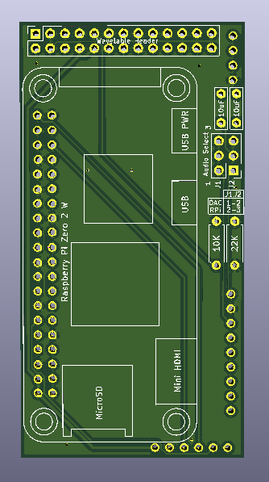

# WavetablePi

WavetablePi is a wavetable module based on the Raspberry Pi Zero 2 W running [mt32-pi](https://github.com/dwhinham/mt32-pi).
It is capable of emulating several midi synthesizers, including mt32, sc55 and general midi with custom sound fonts.
For a complete feature list please refer to the [mt32-pi](https://github.com/dwhinham/mt32-pi) project.

For controlling the mt32-pi from DOS, please use [mt32-pi-control](https://github.com/gmcn42/mt32-pi-control).

# Features

- It currently supports two modes of audio: using the raspberry pi's PWM audio out (which is noisy and sounds pretty bad), and an external Hi-Fi PCM5102A based DAC.
- You can also attach a 0.91 OLED SSD1306 I2C 128x32 display.

# I want to build one myself!
- Please note that the current version of the WavetablePi board is quite tall (76mm x 40mm) so please check if it fits your sound card, especially if it needs to be placed perpendicularly to the ISA slots.
- Also please make sure that there is enough clearance between the WavetablePi and the sound card. Some cards have large components that may touch the raspberry pi a
- A WavetablePi with the DAC or the OLED display takes quite a bit of vertical space, so you will end up wasting one ISA slot! There is just no room for a card right next to the sound card, as the OLED display and the DAC will be in the way.
- Finally please check that the PCM5102A HiFi DAC is in the form factor that fits the board. The one I am using is approximately 32mm x 17mm. Also please check that the pinout matches.
- For ordering the PCB, you usually just need to upload the zipped [gerber files](https://github.com/scrapcomputing/WavetablePi/releases/download/rev0.2/WavetablePi_rev0.2.zip) to the fab's website.

# Bill of materials

Item                                     | ##  | Description
-----------------------------------------|-----|-----------------------------------------
Raspberry Pi Zero 2 W                    | 1   | The older RPi Zero is not fast enough
40-pin 2x20 male header 2.54mm pitch     | 1   | For attaching the RPi to the board.
26-pin 2x13 female header 2.54mm pitch   | 1   | For attaching the board to the wavetable header
6-pin 2x3 pin male header 2.54mm pitch   | 1   | For the audio select jumpers
Jumper 2.54mm pitch                      | 2   | Jumpers for the audio selection header
10uF through-hole ceramic capacitors     | 2   |
Resistor 22K Ohm                         | 1   |
Resistor 10K Ohm                         | 1   |
0.91 OLED SSD1306 I2C 128x32 module      | 1   | (Optional)
PCM5102A I2S DAC Module                  | 1   | (Optional but highly recommended) Please check the PCB for the supported dimensions and form factor!

